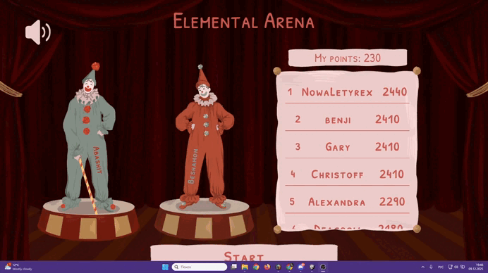

<b>🎪 Elemental Arena</b>
---
A strategic card-puzzle about building the world’s most spectacular elemental circus show.

Elemental Arena is a strategy puzzle game where you become the mastermind behind a magical circus.
Your task is to arrange elemental cards in the correct order to trigger powerful chain reactions and amaze the audience — while climbing the global leaderboard.

This project was originally created for ScoreSpace Jam #36 and placed <b>15th</b> out of 74 projects.

  

<b>🌟 Gameplay Overview</b>
---
At the heart of the game is a reaction board — a grid that defines the interaction outcome between every pair of elements:
The vertical axis represents the element of the first card in the chain.
The horizontal axis represents the element of the next card.

 

Their intersection determines the reaction result:
B-Bonus, D-Destroy, A-Absorb or N-None.
Your goal is to place cards from left to right, forming the strongest possible reaction chain before each show ends.

<b>✔ Key Rules</b>
---
The entire chain is evaluated strictly left → right.

Each new card compares its element to the previous card’s element using the reaction table.

The better your reactions, the higher your score.

The show has a limited number of rounds — reach the highest score before it ends!

<b>🃏 Example</b>
---
If your first card is Animal, and the next one is Electricity, then:
Find Animal on the vertical axis
Find Electricity on the horizontal axis
The reaction at their intersection is Destroy
Many players mentioned that it takes a couple of plays to fully understand the system, but once it clicks — the strategic depth becomes extremely satisfying.

<b>🎭 Strategy Depth</b>
---
Players describe Elemental Arena as:

“Really unique — confusing at first, but extremely fun once it clicks.”
“Crazy combos feel amazing.”
“Probably the most original mechanics in the jam.”

To score high, you must:
Predict the outcome of multiple future reactions
Order the cards for maximum synergy
Take advantage of Bonus chains
Avoid destructive reactions unless they benefit your plan
Adapt to RNG and incomplete information

The game does not go on forever — the circus season has a fixed number of shows.
This wasn't obvious to many new players, so it’s worth noting here.

<b>🏆 Leaderboard</b>
---
The game features a global online leaderboard powered by:
➡️ https://danqzq.itch.io/leaderboard-creator

 

Your goal is to reach the TOP and outperform performers from around the world.

<b>🚀 You can play the latest version here:</b>
---
👉 https://besham0n.itch.io/elemental-arena
